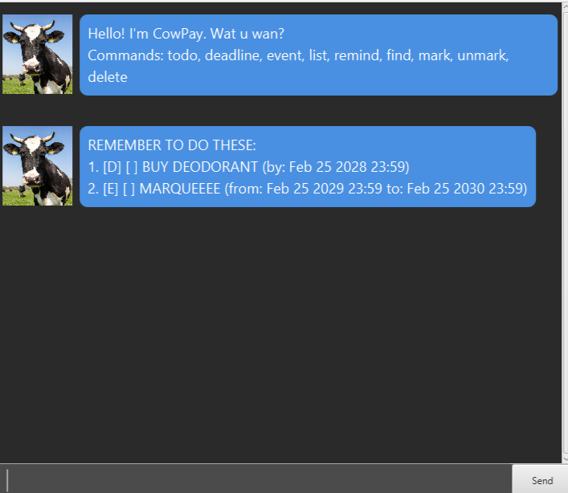

# CowPay 🐮 User Guide

> **"Moove" your productivity to the next level.**

CowPay is a simple task manager that helps students manage their tasks with a **user-friendly** and **minimalist** design.

---

## Quick Start:

1. **Ensure Java is installed**: You need **Java 17** or above on your computer.

2. **Ensure JavaFX is installed**: You need **JavaFX 17.0.18** installed to run the graphical interface.

3. **Download CowPay**: Get the latest `.jar` file from [here](https://github.com/Kevin-129/ip/releases/download/A-Release/cowpay.jar).

4. **Place the file**: Move the `cowpay.jar` into an empty folder. This folder will also store your task data.

5. **Launch the App**:
    * **Option A (The Easy Way):** Simply **double-click** the `cowpay.jar` file.
    * **Option B (The Fail-Proof Way):** If double-clicking doesn't work, open your terminal (Command Prompt/Terminal), `cd` into the folder, and run:  
        `java -jar cowpay.jar`

6. **Start Typing**: Once the GUI appears, type a command (e.g. `todo DON'T SHOWER`) and press **Enter**!



This is the startup page you will see upon launching the app. You will be greeted immediately with a list of your existing reminders so you can see your upcoming tasks at a glance.

---

## Features: 

### Notes about the command format:

* Words in `[brackets]` are the parameters to be supplied by the user.
    * e.g., in `todo [description]`, `[description]` is a parameter which can be used as `todo DON'T SHOWER`.

* You must use the `D/M/YYYY HHmm` format for all dates and times (e.g., `19/1/2030 2359`).
    * The system checks if the date is logically valid (e.g., February 29th only works on leap years).

* Order of parameters must be followed.

* Extraneous parameters for commands that do not take in parameter, such as `list` or `remind`, will be ignored.

---

### 1. Managing Tasks:
You can add three types of tasks. Each task is added to your list.

* 📝 **Todo:** `todo [description]`
    * Adds a basic task without a specific date.
    - **Example:** `todo DON'T SHOWER`

* ⏰ **Deadline:** `deadline [description] /by [date]`
    * Adds a task that needs to be done before a specific time.
    - **Example:** `deadline BUY DEODORANT /by 25/2/2028 2359`

* 📅 **Event:** `event [description] /from [start] /to [end]`
    * Adds a task with a specific duration.
    - **Example:** `event MARQUEEEE /from 25/2/2029 2359 /to 25/2/2030 2359`

---

### 2. Organizing the List:
* **Viewing all tasks:** `list`
    * Shows a list of ALL current tasks in the system.
    - **Example:** `list`

* **Marking as Done:** `mark [index]`
    * Marks the task at the specified number as **Done**.
    * The index refers to the index number shown in the displayed list.
    - **Example:** `mark 1`

* **Unmarking:** `unmark [index]`
    * Reverts a task back to **Not Done**.
    - **Example:** `unmark 2` 

* **Deleting:** `delete [index]`
    * Permanently removes the task from your storage.
    * WARNING: DELETE DOES NOT ASK FOR A `[Y/N]` CONFIRMATION AND IT IS IRREVERSIBLE. PLEASE DOUBLE CHECK BEFORE DELETING.
    - **Example:** `delete 3`

---

### 3. Smart Tools:
* **Locating tasks:** `find [keyword]`
    * Finds tasks whose descriptions contain the specific keyword.
    * The search is case-insensitive.
    - **Example:** `find book`

* **Reminders:** `remind`
    * Displays a list of deadlines and events that are still relevant to you.
    * Only shows tasks that are not marked as Done and have not passed the current time yet.
    * This helps you filter out tasks that are already finished or expired.
    - **Example:** `remind`

---

## Data Management:

* **Saving the data:** CowPay data is saved in the same folder as the CowPay.jar automatically after any command that changes the data.  There is no need to save manually.
    
* **Editing the data file:** Data is saved automatically as a .txt file at `[Folder Location]/data/cowpay.txt`.
    - **Example:** If your CowPay.jar is on your Desktop, your data is stored at desktop/data/cowpay.txt.

* **Caution:** If you manually edit the file and a line is invalid, CowPay will just skip that specific line instead of discarding all your data.

* **Recovery:** If the file gets deleted or corrupted while the app is running, any command that edits your tasks will automatically generate a new file to save the current state of your app. (e.g. todo, deadline, event, mark, unmark, delete)

---

## FAQ

1. **Q: How do I transfer my data to another Computer?**
   **A:** Install the app in the other computer and overwrite the empty data file it creates with the `cowpay.txt` file that contains the data of your previous CowPay home folder.

2. **Q: Why is my task list empty even though I saved it?** 
   **A:** Check if you moved the `CowPay.jar` file to a different folder. The app looks for the data folder in the same folder as the jar file.

---

## Known issues

1. **Multiple Instances:** If you open multiple CowPay windows at the same time, they will overwrite each other's data.
   * **Solution:** Only have 1 window of the application opened at any one time.


2. **Past Dates:** The app accepts deadlines and events that are set way before the current time. 
   * These tasks will be recorded in your list, but using the `remind` command will only show tasks that have not yet passed and have not been completed.
   * **Example 1 :** `deadline SUBMIT HISTORY ESSAY /by 01/01/1800 2359`
   * **Example 2 :** `event CHINESE NEW YEAR /from 20/07/1960 1200 /to 20/07/1970 1800`

---

## Command Summary:

| Action | Format | Example |
| :--- | :--- | :--- |
| **Add Todo** | `todo [description]` | `todo SKIP 2103` |
| **Add Deadline**| `deadline [description] /by [date]` | `deadline BUY MILK /by 25/2/2028 2359` |
| **Add Event** | `event [description] /from [start] /to [end]` | `event TAKE LOA /from 25/2/2029 /to 25/2/2030` |
| **List** | `list` | `list` |
| **Mark** | `mark [index]` | `mark 1` |
| **Delete** | `delete [index]` | `delete 3` |
| **Find** | `find [keyword]` | `find CS2103` |
| **Remind** | `remind` | `remind` |

---

## Code Example:
Here’s a simple code snippet that showcases all the commands of the app:

```java
public class CowPay {

    private static final String COMMANDS = "todo, deadline, event, list, remind, find, mark, unmark, delete";

    //Other fields and methods here...
}
```

---

## Next Steps:

1. [ ] Download the `cowpay.jar` file from [GitHub](https://github.com/Kevin-129/ip/releases/download/A-Release/cowpay.jar)
2. [ ] Try adding a task using the todo command
3. [ ] Set a deadline using the deadline command
4. [ ] Use the remind command to view all tasks

*Tip*: Use the `remind` command to quickly view all deadlines and events.